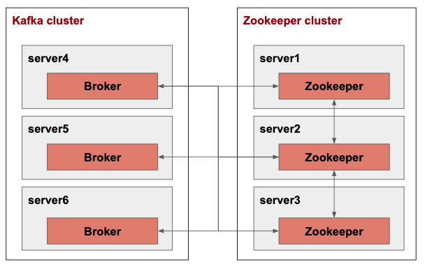

# Overview
kafka cluster 구축<br>
구조는 아래와 같음<br>
<br>
kafka에서 사용되는 zookeeper는 write intensive하기에 별도의 장비로 구성하는 것을 추천한다고 함<br>


# Environments
* openjdk 11
* kafka 2.2


# Cluster setup
### zookeeper cluster
zookeeper는 kafka에 내장된 것을 사용<br>
zookeeper cluster는 https://github.com/vanryuji/zookeeper/tree/master/zookeeper_cluster 참조<br>
만약 zookeeper를 kafka 내장 binary를 사용한다면 아래와 같이 스타트 시킴<br>
```shell
# kafka 내장 zookeeper 스타트

./bin/zookeeper-server-start.sh config/zookeeper.properties
```


### kafka cluster
```shell
# 자세한 broker configure 내용은 https://kafka.apache.org/documentation/#brokerconfigs 참조

# config/server.properties in server4
broker.id=1
zookeeper.connect=server1:2181,server2:2181,server3:2181

# config/server.properties in server5
broker.id=2
zookeeper.connect=server1:2181,server2:2181,server3:2181

# config/server.properties in server6
broker.id=3
zookeeper.connect=server1:2181,server2:2181,server3:2181
```

### start kafka broker cluster
```shell
# server4, server5, server6 모두 동일

./bin/kafka-server-start.sh config/server.properties
```

# Producer/Consumer for multiple brokers
https://www.facebook.com/groups/kafka.kru/permalink/638812169893443/
lb를 두는게 좋은 방법인듯하나... lb도 다운되면...?


# Reference
* https://kafka.apache.org/
* https://epicdevs.com/20
